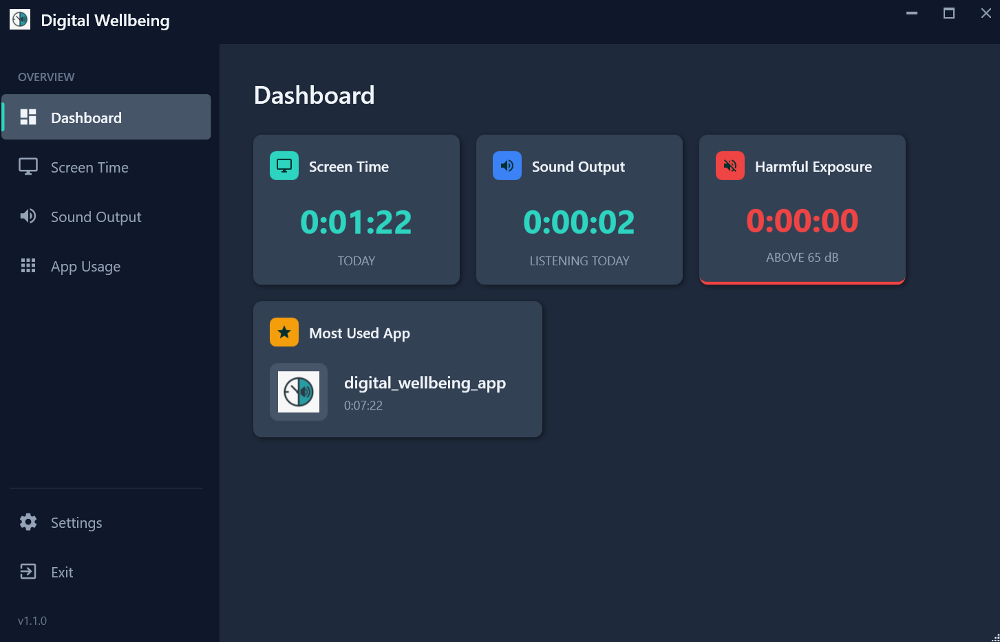
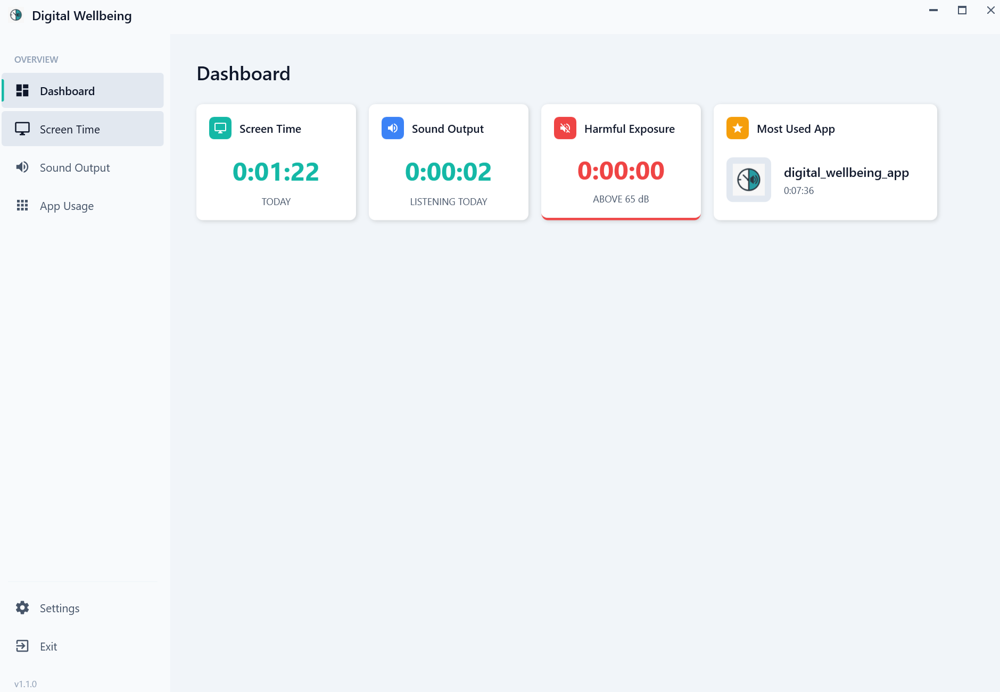
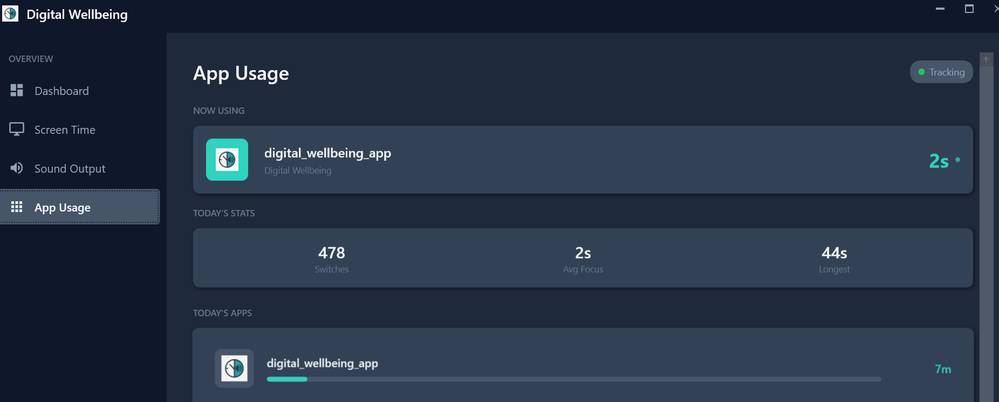
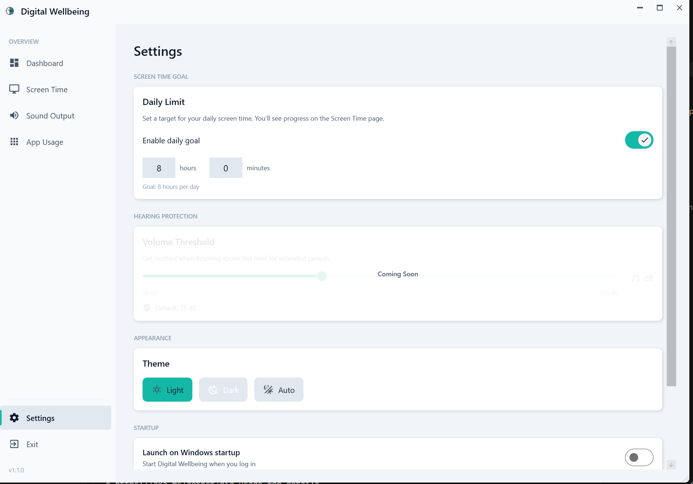

# Digital Wellbeing for Windows

[](LICENSE)
[](https://dotnet.microsoft.com/)
[](https://www.microsoft.com/windows)
[](https://github.com/swarajdhondge/digitalwellbeingpc/releases)
[](https://github.com/swarajdhondge/digitalwellbeingpc/releases)

A privacy-focused desktop app that brings Android's Digital Wellbeing experience to Windows. Track your screen time, monitor app usage, and protect your hearing — all without sending any data to the cloud.

<p align="center">
  
</p>

---

## Features

**Screen Time Tracking**
See exactly how long you've been at your computer. View daily timelines, weekly breakdowns, and track your longest sessions.

**App Usage Monitoring**
Know which apps you spend the most time in. Get real-time tracking with focus metrics like app switches and average focus duration.

**Sound Exposure Alerts**
Protect your hearing. The app monitors audio output levels and warns you when you've been exposed to loud sound for too long.

**Daily Goals**
Set screen time limits and track your progress throughout the day.

**Themes**
Choose between Light, Dark, or Auto theme to match your preference or system settings.

<p align="center">
  
  
</p>

**Privacy First**
All data stays on your machine in a local SQLite database. No accounts, no cloud sync, no telemetry.

**Auto Updates**
The app checks for updates automatically and installs them seamlessly.

---

## Screenshots

<details>
<summary>Screen Time View</summary>
<p align="center">
  
</p>
</details>

<details>
<summary>App Usage View</summary>
<p align="center">
  
</p>
</details>

<details>
<summary>Settings</summary>
<p align="center">
  
</p>
</details>

---

## Installation

### Download (Recommended)

1. Go to the [Releases](https://github.com/swarajdhondge/digitalwellbeingpc/releases) page
2. Download `Setup.exe` from the latest release
3. Run it — that's it!

The app installs without admin rights and updates automatically.

### Run from Source

If you want to build it yourself:

```bash
# Clone the repo
git clone https://github.com/swarajdhondge/digitalwellbeingpc.git
cd digitalwellbeingpc

# Run the app
dotnet run --project digital-wellbeing-app
```

**Requirements:**

- [.NET 9 SDK](https://dotnet.microsoft.com/download/dotnet/9.0)
- Windows 10/11

---

## How It Works

The app runs quietly in your system tray and tracks:

- **Screen time** — Active vs away time based on mouse/keyboard activity
- **App usage** — Which window is in the foreground and for how long
- **Audio levels** — System audio output to detect harmful exposure

All tracking pauses automatically when you lock your screen or your PC goes to sleep.

---

## Contributing

Contributions are welcome! Here's how you can help:

1. **Fork** the repository
2. **Create a branch** for your feature (`git checkout -b feature/my-feature`)
3. **Commit** your changes (`git commit -m "Add my feature"`)
4. **Push** to your branch (`git push origin feature/my-feature`)
5. **Open a Pull Request**

### Ideas for Contributions

- Break reminders / Pomodoro timer
- Usage reports and exports
- Focus mode (block distracting apps)
- Improved sound monitoring UI

---

## Tech Stack

- **WPF** with Material Design
- **SQLite** for local storage
- **.NET 9**
- **Velopack** for updates and installation

---

## About This Project

A Windows variant of Android's Digital Wellbeing — bringing screen time tracking, app usage monitoring, and hearing protection to your desktop. Built for anyone who wants to be more mindful of their computer usage without sacrificing privacy.

---

## License

[MIT](LICENSE) — use it however you like.
