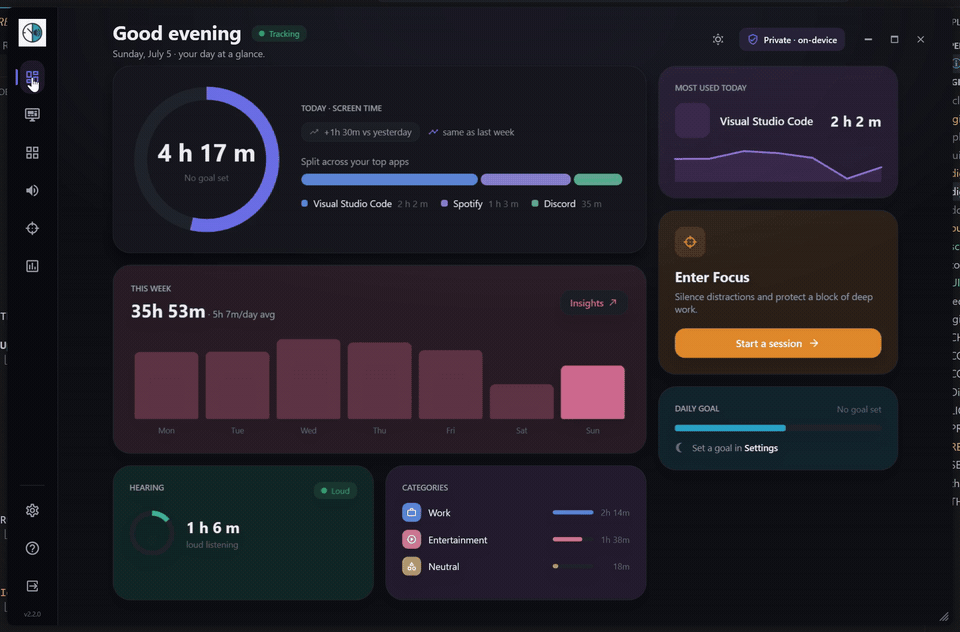

# Pulse — Digital Wellbeing for Windows

_Android-style Digital Wellbeing for Windows — calm, private, and 100% on-device._

[](LICENSE)
[](https://dotnet.microsoft.com/)
[](https://www.microsoft.com/windows)
[](https://github.com/swarajdhondge/digitalwellbeingpc/releases)
[](https://github.com/swarajdhondge/digitalwellbeingpc/releases)

**Pulse** brings the Android Digital Wellbeing experience to Windows: track your screen time, see which apps eat your hours, run focus sessions, and protect your hearing — in a calm, redesigned interface. No account, no cloud, no telemetry; every byte stays on your PC.

<p align="center">
  <!-- Committed at .github/demo/demo.gif (regenerated by scripts/record-demo.ps1).
       NOTE: don't use a GitHub release-asset URL here — release assets are served as
       octet-stream attachments and won't render inline as an image. -->
  
</p>

---

## Features

- **Screen Time** — Today, weekly, and past-week views; daily totals, longest sessions, weekly averages.
- **App Usage** — Top apps ranked by time with icons, plus focus metrics (app switches, average focus).
- **Focus Sessions** — 15/25/45/60/90-min or custom; Warn mode nudges you, Block mode auto-minimizes distractions; full session history.
- **Hearing Protection** — Real-time audio monitoring flags listening above 75 dB, with a color-coded safe/harmful timeline.
- **Break Reminders** — 20-20-20-rule reminders; snooze up to 3×; idle time counts as a break automatically.
- **Wind Down** — Scheduled quiet hours with a gentle border glow (Amber / Purple / Dim), overnight-aware.
- **Daily Goals** — Set a screen-time limit and track it with a dashboard progress ring.
- **Weekly Reports** — Daily averages, peak usage times, top apps, and a week-over-week comparison.
- **Data Export** — Screen time, app usage, and sound data to CSV for any date range.
- **Calm design** — Graphite UI with a signature accent per section; Light, Dark, or Auto.

<p align="center">
  
  
</p>

**Private by design** — everything lives in a local SQLite database. No accounts, no cloud, no telemetry. Tracking pauses automatically when your PC is locked or asleep. The app updates itself seamlessly.

**Stays out of your way** — closing the window keeps Pulse tracking in the system tray (quit anytime from the tray icon; toggle it off in Settings → Startup).

<details>
<summary>More screenshots</summary>

<p align="center">
  
  
  
  
  
  
</p>
</details>

---

## Install

<a href="https://apps.microsoft.com/detail/9ND5GNMBQVQ7">
  
</a>

The [**Microsoft Store**](https://apps.microsoft.com/detail/9ND5GNMBQVQ7) build is signed by Microsoft, updates itself, and never triggers a SmartScreen prompt — the easiest way to install.

Prefer the direct download? Grab `Setup.exe` from the [latest release](https://github.com/swarajdhondge/digitalwellbeingpc/releases). It installs without admin rights and updates itself automatically.

> [!NOTE]
> **"Windows protected your PC"?** That's SmartScreen — expected the first time you run `Setup.exe`, because the GitHub build isn't code-signed *yet* (not because anything's wrong). Click **More info → Run anyway**, or use the [Microsoft Store](https://apps.microsoft.com/detail/9ND5GNMBQVQ7) build to avoid the prompt entirely. Every release also ships `SHA256SUMS.txt` to verify your download.

**Build from source:**

```bash
git clone https://github.com/swarajdhondge/digitalwellbeingpc.git
cd digitalwellbeingpc
dotnet run --project digital-wellbeing-app
```

Requires the [.NET 9 SDK](https://dotnet.microsoft.com/download/dotnet/9.0) and Windows 10/11.

---

## Tech stack

WPF · .NET 9 · SQLite · NAudio · [Velopack](https://velopack.io) (install + auto-update) · xUnit

## Contributing

Fork → branch → PR. Ideas welcome: multi-monitor support, Pomodoro integration, deeper usage-trend insights. See the [issues](https://github.com/swarajdhondge/digitalwellbeingpc/issues).

## License

GPL-3.0 © 2026 Swaraj Dhondge — free software, **no warranty**; derivative works must stay GPL-3.0. See [LICENSE](LICENSE), [third-party notices](THIRD-PARTY-NOTICES.md), and [privacy](PRIVACY.md).
