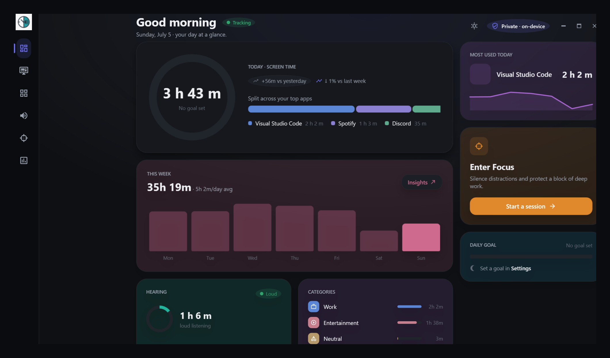
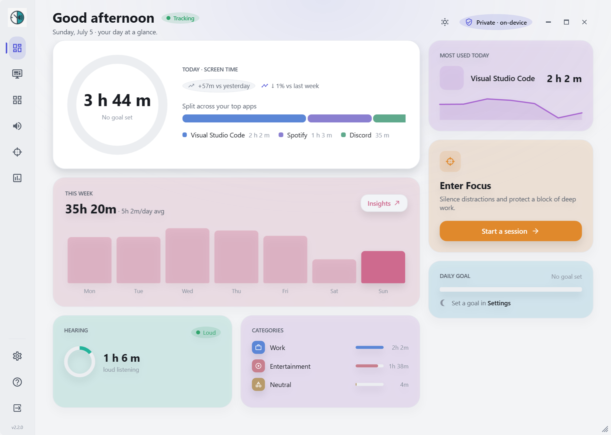
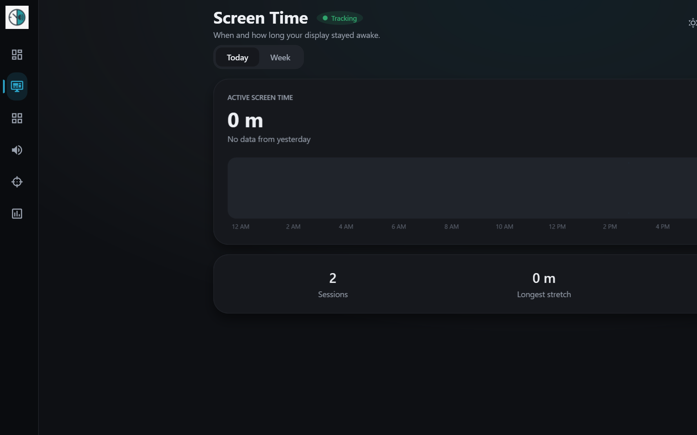
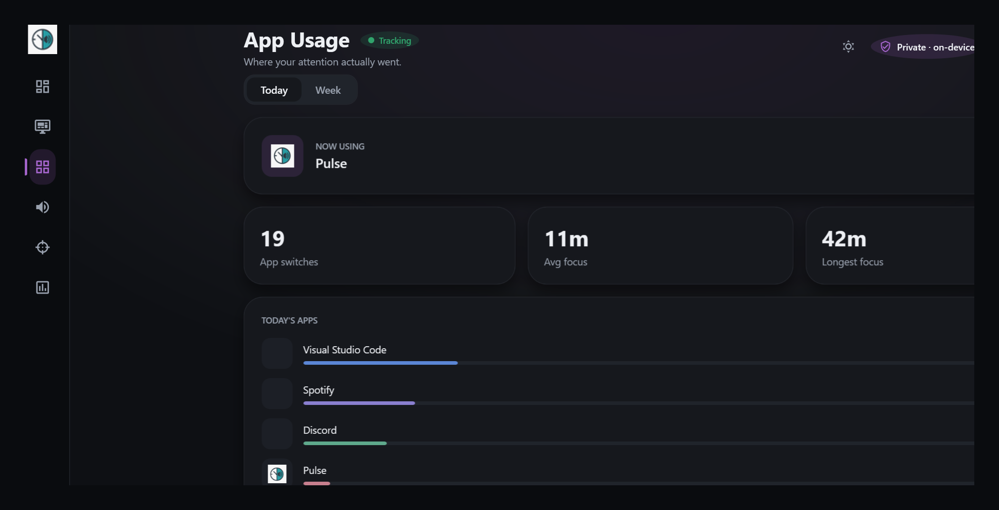
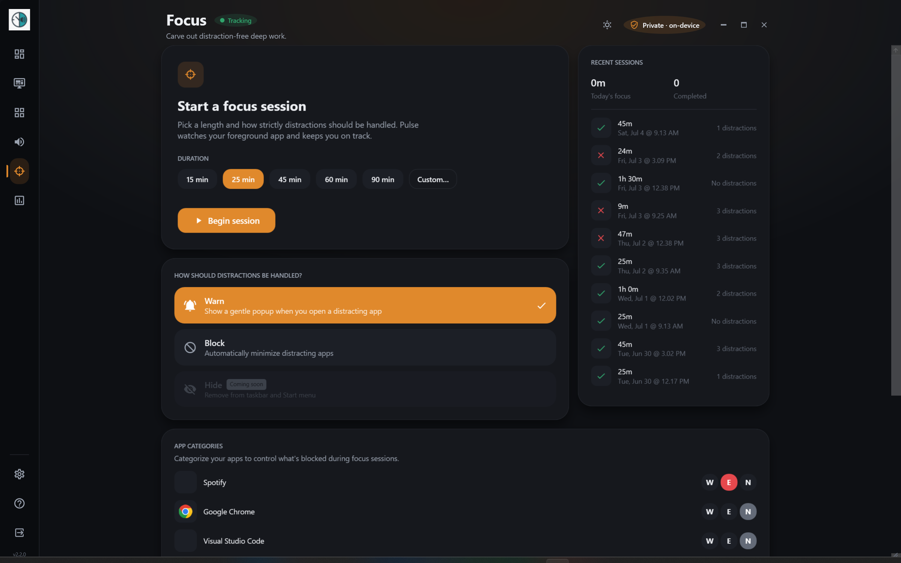
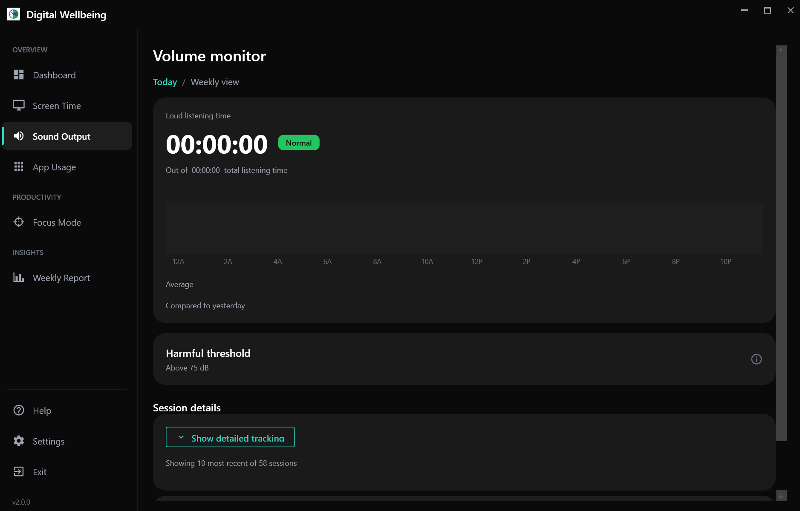
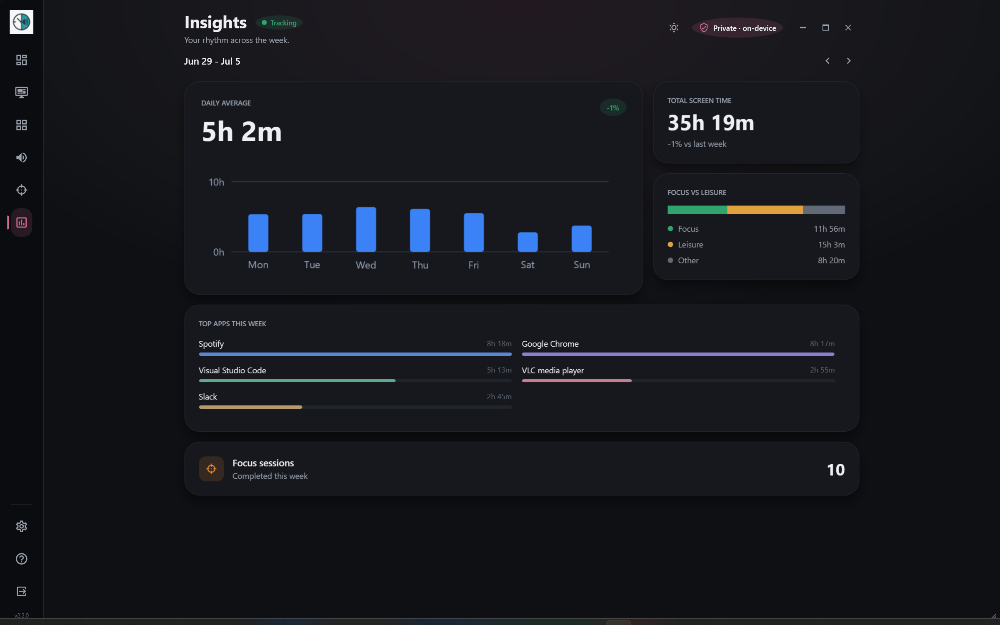
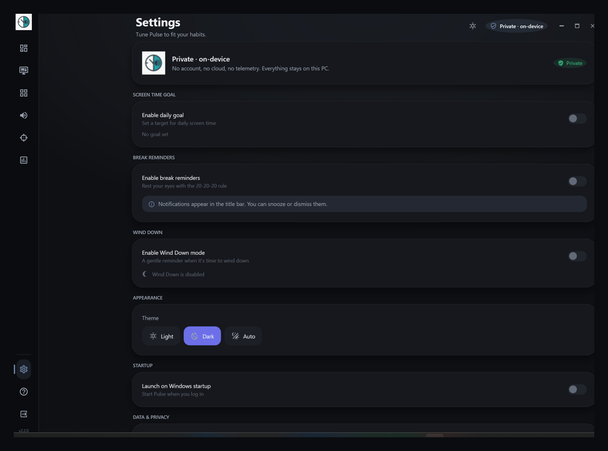
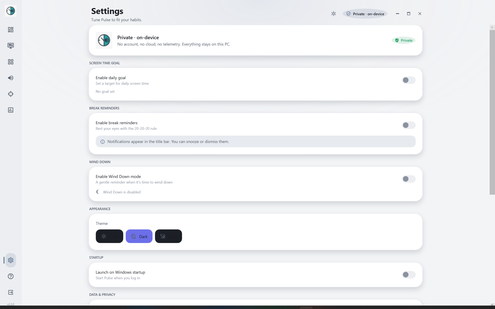
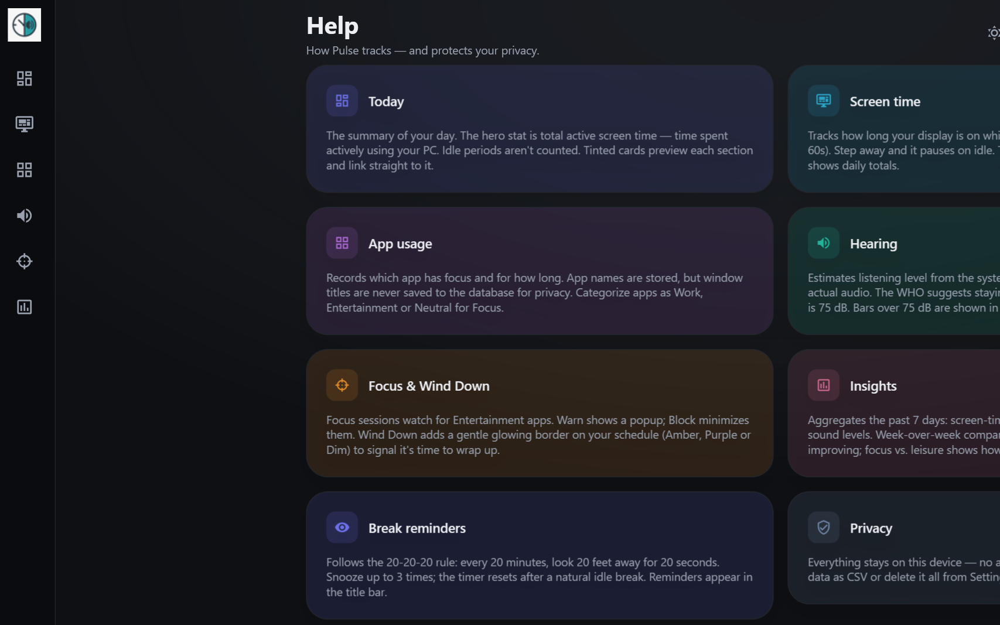

# Digital Wellbeing for Windows

[](LICENSE)
[](https://dotnet.microsoft.com/)
[](https://www.microsoft.com/windows)
[](https://github.com/swarajdhondge/digitalwellbeingpc/releases)
[](https://github.com/swarajdhondge/digitalwellbeingpc/releases)

A privacy-focused desktop app that brings Android's Digital Wellbeing experience to Windows. Track your screen time, monitor app usage, manage focus sessions, and protect your hearing. All data stays local on your machine.

<p align="center">
  
</p>

---

## Features

**Screen Time Tracking**
See how long you've been at your computer. Switch between Today and Weekly views, navigate past weeks, and track your daily totals, longest sessions, and weekly averages.

**App Usage Monitoring**
Know which apps eat up your time. Top apps ranked by duration with icons and friendly names, plus focus metrics like app switches and average focus duration.

**Focus Sessions**
Pick a duration (15/25/45/60/90 min or custom), tag your apps as Work, Entertainment, or Neutral, and stay on task. Warn mode nudges you with notifications, Block mode auto-minimizes distracting apps. Session history tracks your distractions and completion stats.

**Sound Exposure Monitoring**
Monitors your audio output in real time and flags anything above 75 dB. A color-coded timeline shows safe vs harmful listening so you can protect your hearing.

**Break Reminders**
Configurable reminders (15-60 min) based on the 20-20-20 rule. Shows an overlay when visible or a tray notification when minimized. Snooze up to 3 times. Idle time counts as a break automatically.

**Wind Down Mode**
Schedule quiet hours with a gentle border glow to remind you it's time to rest. Pick from Amber, Purple, or Dim styles. Works with overnight schedules like 9 PM to 7 AM.

**Daily Goals**
Set a screen time limit and track it with a progress bar on the dashboard. Get notified when you go over.

**Weekly Reports**
Full weekly breakdown with daily averages, peak usage times, top apps, and a comparison to the previous week.

**Data Export**
Export screen time, app usage, and sound data to CSV. Pick a date range and save location.

**System Tray**
Runs quietly in the tray. Double-click to open, right-click for quick access to focus mode, reports, and settings.

**Welcome Screen and Help**
A first-run welcome screen shows how your data is stored. Built-in Help with FAQ is always in the sidebar.

**Themes**
Light, Dark, or Auto to match your system settings.

<p align="center">
  
  
</p>

**Privacy First**
All data stays on your machine in a local SQLite database. No accounts, no cloud sync, no telemetry.

**Auto Updates**
The app checks for updates automatically and installs them seamlessly.

---

## Screenshots

<details>
<summary>Screen Time View</summary>
<p align="center">
  
</p>
</details>

<details>
<summary>App Usage View</summary>
<p align="center">
  
</p>
</details>

<details>
<summary>Focus Mode</summary>
<p align="center">
  
</p>
</details>

<details>
<summary>Sound Exposure</summary>
<p align="center">
  
</p>
</details>

<details>
<summary>Weekly Report</summary>
<p align="center">
  
</p>
</details>

<details>
<summary>Settings</summary>
<p align="center">
  
  
</p>
</details>

<details>
<summary>Help Section</summary>
<p align="center">
  
</p>
</details>

---

## Installation

### Download (Recommended)

1. Go to the [Releases](https://github.com/swarajdhondge/digitalwellbeingpc/releases) page
2. Download `Setup.exe` from the latest release
3. Run it and you're done

The app installs without admin rights and updates automatically.

### Run from Source

If you want to build it yourself:

```bash
# Clone the repo
git clone https://github.com/swarajdhondge/digitalwellbeingpc.git
cd digitalwellbeingpc

# Run the app
dotnet run --project digital-wellbeing-app
```

**Requirements:**

- [.NET 9 SDK](https://dotnet.microsoft.com/download/dotnet/9.0)
- Windows 10/11

---

## How It Works

The app runs quietly in your system tray and tracks:

- **Screen time** - Active vs idle time based on mouse/keyboard activity
- **App usage** - Which window is in the foreground and for how long
- **Audio levels** - System audio output to detect harmful sound exposure
- **Focus sessions** - Monitors your foreground app and enforces your focus rules
- **Break timing** - Tracks continuous usage and reminds you to take breaks
- **Wind Down schedule** - Checks your quiet hours and shows a visual cue when active

All tracking pauses automatically when you lock your screen or your PC goes to sleep.

---

## Contributing

Contributions are welcome! Here's how you can help:

1. **Fork** the repository
2. **Create a branch** for your feature (`git checkout -b feature/my-feature`)
3. **Commit** your changes (`git commit -m "Add my feature"`)
4. **Push** to your branch (`git push origin feature/my-feature`)
5. **Open a Pull Request**

### Ideas for Contributions

- Notification customization
- Multi-monitor support
- Pomodoro technique integration
- Usage trend analysis and insights

---

## Tech Stack

- **WPF** with Material Design
- **SQLite** for local storage
- **.NET 9** targeting Windows 10+
- **NAudio** for audio monitoring
- **Velopack** for updates and installation
- **xUnit** for testing

---

## About This Project

A Windows variant of Android's Digital Wellbeing. Track screen time, monitor app usage, manage focus sessions, get break reminders, and protect your hearing on your desktop. Built for anyone who wants to be more mindful of their computer usage without sacrificing privacy.

---

## License

[MIT](LICENSE) - use it however you like.
